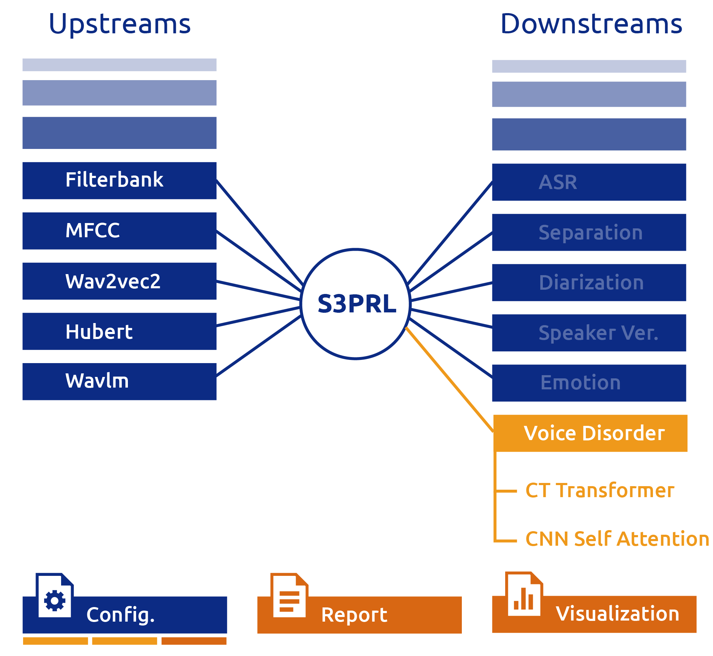
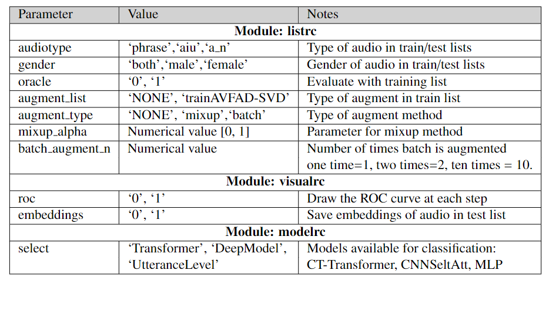

# Voice Disorder Detection Downstream 
In this branch there is a downstream for Automatic Voice Disorder Detection (AVDD) based on S3PRL toolkit. As frontend you can use any Self-Supervised representation from S3PRL including Wavlm, HuBERT, Wav2Vec, etc (see more upstreams at https://github.com/s3prl/s3prl). As backend there are several models available for classification including: 
* *MLP:* Basic pooling + linear layer
* *CNNSelfAttention:* Convolutional Neural Network with Self Attention mechanism
* *Transformer:* 2-layer ViT-Transformer

<p align="center">
    
    <br>
</p>

## Databases 

So far the databases included in this downstream are the following (both are free available):
* **SVD** Saarbruecken Voice Database 
(http://www.stimmdatenbank.coli.uni-saarland.de/help_en.php4)
* **AVFAD** Advanced Voice Function Assessment Database 
(http://acsa.web.ua.pt/AVFAD.htm)
* **THALENTO** ViVoLab Database for Automatic Detection of Voice Disorders (Under construction, soon release)
(http://dihana.cps.unizar.es/~thalento/)

You need to locate the datasets in the following directories (see the audio path format in downstream/voicedisorder/data/lst/*.json): 
- downstream/voicedisorder/data/audio/Saarbruecken
- downstream/voicedisorder/data/audio/AVFAD
- downstream/voicedisorder/data/audio/THALENTO

## Usage
For running an experiment you need to clone the repo and install S3PRL toolkit as authors indicated at https://github.com/s3prl/s3prl).

### Installation
1. Clone repo

```
git clone https://github.com/dayanavivolab/s3prl.git -b voicedisorder
```

2. Create and activate environment (Python >= 3.6)

``` 
cd s3prl
python -m venv s3prl_voicedisorder
source s3prl_voicedisorder
```

3. Install **sox** 
4. Install **s3prl**

```
python -m pip install -e ./
```

5. Install **fairseq**

```
git clone https://github.com/pytorch/fairseq
cd fairseq
python -m pip install --editable ./
```

6. Install **torch** (if you already have your own torch skip this step)

```
pip install torch==1.8.1+cu111 torchvision==0.9.1+cu111 torchaudio==0.8.1 -f https://download.pytorch.org/whl/torch_stable.html
```

7. Install packages
```
pip install requirements_voicedisorder.txt
```

### Run experiment
For running experiments to do train and evaluation you can use (modify accordingly):   
```
sh run_voicedisorder.sh 
```

For doing evaluation of a certain list of audios using a pretrained model you can use (modify accordingly):   
```
sh run_voicedisorder_evaluation.sh 
```

## Configuration
But first, please configurate the script accordingly by choosing: 
* Training type: finetune, basic
* Audiotype: phrase, aiu, a_n
* Frontend: wavlm, hubert, wav2vec, fft (see more upstreams at https://github.com/s3prl/s3prl)
* Backend: Transformer, CNNSelfAtt, MLP

Also, see the following table with a description of the config files at s3prl/downstream/voicedisorder/config.

<p align="center">
    
</p>

### Results
Experimental results are located in s3prl/result/downstream/yourfoldername.

Also you can get several system performance metrics by using: 
```
python compute_metrics_full.py s3prl/result/downstream yourdirname 5
```
Or you can visualize the embeddings by using (remember save the embeddings setting embeddings '1' in the config file): 
```
python compute_umap_tsne.py result/downstream/yourdirname/embeddings
```
# 

## Citation

If you find this toolkit useful, please consider citing the following paper.
```
@inproceedings{s3prldisorder_iberspeech2022,
  author={Dayana Ribas and Miguel Angel Pastor and Antonio Miguel and David Martinez and Alfonso Ortega and Eduardo Lleida},
  title={{S3prl-Disorder: Open-Source Voice Disorder Detection System based in the Framework of S3PRL-toolkit.}},
  year=2022,
  booktitle={Proc. Iberspeech 2022},
  pages={136--140},
  url={https://www.isca-speech.org/archive/pdfs/iberspeech_2022/ribas22_iberspeech.pdf}
}
```

## Contact
email: dribas@unizar.es
